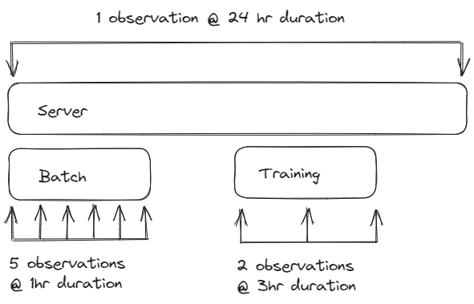

**Status**: Draft
**Author**: Asim Hussain (@jawache)
**Abstract**: Describes an observation in the context of an Impact Graph.

Observations are a core component of an [Impact Graph](design/Impact%20Graph.md) (graph), and they form the primary input into an [Impact Model Plugin](design/Impact%20Model%20Plugin.md) (model).

An **observation** is something you measure regarding a component in your software system. For example, an observation about a server might be CPU utilization. Observations are passed into models which generate impact metrics.

Different models require different kinds of observations. If a model converts billing data to carbon emissions, the observations must include billing information. Observations can be varied, billing data, utilization, number of users over time, responses from a survey, they can be anything at all.

- All observations have a **timestamp** and **duration**.
- Observations can be n-dimensional; each time and duration can have multiple values, e.g., CPU and Mem utilization.
- Observations are always a time series. Even if you only pass in one observation with a long duration, it's still a time series with one entry.

In [Impact YAML](design/Impact%20YAML.md), observations are expressed like so:

```yaml
  series:      
	- timestamp: 2023-07-06T00:00
	  duration: 5
	  cpu: 0.34
	- timestamp: 2023-07-06T00:05
	  duration: 5
	  cpu: 0.23
	- timestamp: 2023-07-06T00:05
	  duration: 5
	  cpu: 0.11
```

But they can also be stored in CSV files like so:

| Timestamp           | Duration | CPU | Mem | Disk |
| ------------------- | -------- | --- | --- | ---- |
| 2023-07-26T13:00:00 | 15       | 23  | 87  | 2    |
| 2023-07-26T13:00:15 | 15       | 26  | 86  | 4    |
| 2023-07-26T13:00:30 | 15       | 46  | 76  | 6    |
| 2023-07-26T13:00:45 | 15       | 2  | 60   | 10   |
| 2023-07-26T13:01:00 | 15       | 4  | 55   | 1    |

#### Default Units and Names

Each type of observation has a **default unit** and **default name**. For example, if you observe a CPU utilization, the name of the observation dimension is `CPU`, and the unit is as a `percentage`. The data passed in is expected to be in that format.

| Dimension | Unit                |
| --------- | ------------------- |
| CPU       | Percentage Utilized |
| MEM       | Percentage Full     |
| Disk      | ????                |
| Duration  | Seconds             |
| Timestamp | ISO Time            |


## Observation synchronization

Each component in your graph needs observations; we need observations to compute impacts.

A helpful feature of the engine is that you don't need to synchronize all your input observations for all your components with each other. You can provide observations at different intervals for every component in the graph. 




In the [Normalization](design/Impact%20Graph%20Pipeline.md#Normalization|Normalization) phase of the computation of a graph, we do synchronize the output Impact Metrices, but we don't need the input Observations synchronized to do this.

### How does an Observation differ from Telemetry?

Telemetry is the automatic recording and transmission of very fine-grain data about a software system from remote sources. You can gather an Observation from anything, **including human judgment**, assumptions, other models, survey data, and spreadsheets. Observations tend to be at a higher grain, with durations more likely in the range of 5 mins to an hour. Observations and telemetry work hand in hand; observations will usually be collected by querying a system that has collected Telemetry to create a time series, for example, Prometheus.

### Observations drive temporal granularity

As discussed in the [Granularity](design/Granularity.md) design document, an essential feature of the [Impact Engine Framework](Impact%20Engine%20Framework.md) is to provide a granular analysis of the impacts of a software system.

One dimension of granularity is time, and observations are how we provide that temporal granularity.

You can provide one single observation for a long duration for every component in an [Impact Graph](design/Impact%20Graph.md); however, this won't give you a view of how the impacts changed over time. 

This is why Observations are a time series; the more observations you can provide about components over time, the more the engine can surface impacts over time.

Another reason to provide multiple observations is to gain a much more accurate emissions estimate. Many of the models used to translate observations into impacts are non-linear. This means just providing an average value over time will give you a less accurate value than providing more data points over time.